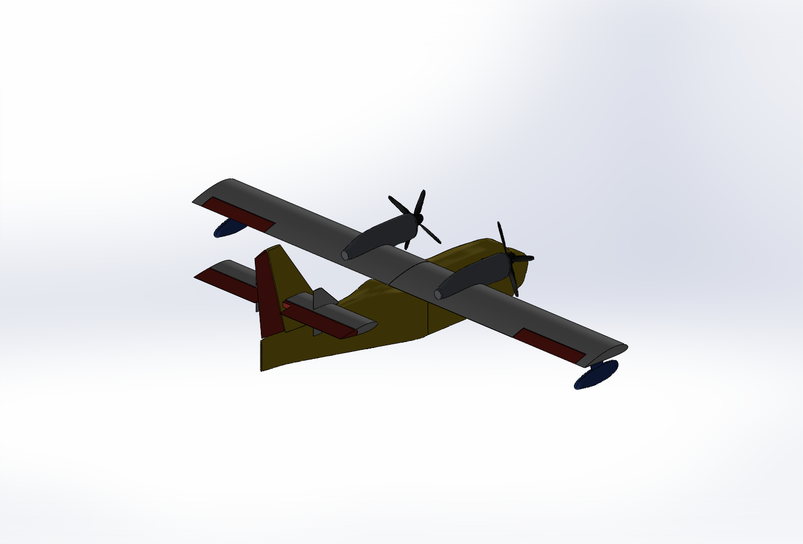
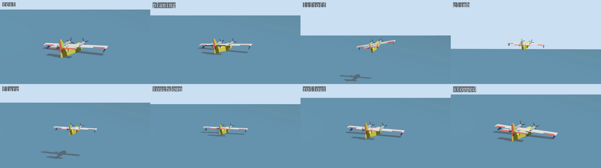

# Scaled CL-415 UAV: CAD, SolidWorks parts and Gazebo model

This folder turns `cl415.obj` into a parametric CAD model of the 2.51 m span CL-415 research UAV, builds
real SolidWorks parts and an assembly from it, measures the mass properties in SolidWorks, and packages
everything as a ROS 2 Jazzy / Gazebo Harmonic model (`cl415_description`). The project specs (NACA 4417,
10.5 kg with 3 L of water, 2.51 m span, 0.278 m chord) override the OBJ wherever the two disagree.



## Where we are now

The aircraft is modelled end to end and it flies in simulation. The CAD and the SolidWorks mass properties
are done (10.5 kg full, CG at 27 % MAC), the aero and propulsion numbers come from AVL, XFOIL and APC prop
data, and the whole thing runs under PX4 v1.16.2 in Gazebo Harmonic with Mission Planner as the ground
station. Both a runway variant and a water variant fly a full mission in AUTO.MISSION (take-off, circuit,
auto landing) with no operator input. The water one takes off from and lands on calm water using our own
flying-boat hull plugin. Cruise throttle in the sim is 0.55 against 0.556 predicted, altitude tracks within
1.3 m rms and airspeed within 0.5 m/s.

The controller is PX4's stock fixed-wing stack (rate loops, attitude loop, TECS, NPFG), not ArduPlane and not
a new design yet. We only set its parameters from the aircraft model (feed-forwards from the AVL derivatives,
moderate P and I gains). Designing and tuning our own loops against the MATLAB model is the next step, along
with waves, wind and the water drop itself.

[](px4_sitl/flight_logs/water_highlights_2026-10-04_03-02.mp4)

Water take-off and landing from the chase and tail cameras (click for the video,
`px4_sitl/flight_logs/water_highlights_2026-10-04_03-02.mp4`). Setup and results are in `px4_sitl/README.md`,
the full model write-up is `docs/aircraft_model_and_control.md`.

Each step writes its own report with the full working: `obj_inspect/report.md`, `mass/report.md`,
`aero/report.md`, `verify/report.md`, plus `cad/interference.md`.

The numbers for flight simulation (AVL stability and control derivatives, XFOIL airfoil data, drag polar,
stall, propulsion requirements and motor/prop candidates, PX4 starting values, and a drop-in file for the
team's `params.yaml` schema) are in `flight_params/`, starting at `flight_params/README.md`.

The PX4 SITL setup (Gazebo Harmonic in WSL, Mission Planner on Windows, runway and water variants, the
flying-boat hull plugin, flight logs and plots) is in `px4_sitl/`, starting at `px4_sitl/README.md`.

`docs/aircraft_model_and_control.md` is the single write-up of the aircraft model (geometry, mass, balance,
aero, propulsion, actuators, hull) and the PX4 controller with the values in use; `docs/make_model_doc.py`
regenerates it from the data files.

## Layout

```
cl415.obj                       source mesh (full-size CL-415, metres)
obj_inspect/                    step 1: inspect_obj.py, report.md, measurements.json, renders/
cad/
  build_cad.py                  step 2: parametric CadQuery model, every part a separate solid
  cl415_assembly.step / .stl    whole aircraft (STEP keeps part names and colours, units metres)
  parts/*.step, parts/*.stl     one file per part, all in the aircraft frame
  geometry.json                 volumes, hinge lines, link frames, collision boxes, areas for the aero
  check_interference.py         pairwise clash check -> interference.md (all zero)
  renders/                      CAD views and CAD-vs-OBJ outline overlays
  solidworks/
    build_sw.py                 STEP -> SLDPRT, densities, assembly with Full/Empty configs, mass props
    parts/*.SLDPRT              28 SolidWorks parts (16 structure, 11 equipment, the 3 L water body)
    cl415_assembly.SLDASM       configurations Full (10.5 kg) and Empty (7.5 kg)
    sw_mass_props.json          what SolidWorks measured, per part and per configuration
mass/mass_props.py              step 3: budget, battery placement, URDF link inertials (report.md)
aero/aero_params.py             step 4: LiftDrag and motor parameters with the working (report.md)
tools/                          obj reader, renderer, SolidWorks COM helpers, xacro and SDF exporters
cl415_description/              ROS 2 package
  urdf/cl415.urdf.xacro         main model, args tank:=full|empty, water_damping:=false|true
  urdf/cl415.gazebo.xacro       servos, joint states, odometry, IMU, optional water damper
  urdf/cl415_generated.xacro    numbers only (inertia, joints, collisions, aero, motors), generated
  meshes/*.stl                  visual meshes in their link frames, 2.5k-16k triangles each
  models/cl415_full, cl415_empty  SDF versions for plain Gazebo
  worlds/water.sdf, ground.sdf, water_cl415.sdf
  launch/sim.launch.py, config/bridge.yaml
verify/                         step 5: check_urdf.sh, run_sim_tests.sh, sim_probe.py, hydrostatics.py,
                                analyse.py, report.md, plots/
flight_params/                  AVL / XFOIL / propulsion numbers, cl415_params.yaml, MATLAB check
px4_sitl/                       PX4 + Gazebo Harmonic: models, worlds, airframes, hull plugin, flight logs
docs/                           aircraft_model_and_control.md and the script that generates it
build_all.py                    runs steps 1 to 4 in order (and the WSL checks with --wsl)
```

## Rebuilding

```bash
python -m venv .venv && .venv/Scripts/python -m pip install -r requirements.txt
.venv/Scripts/python build_all.py --wsl      # about 17 min with SolidWorks open; --no-sw skips SolidWorks
```

`build_all.py` runs every step in order (OBJ inspection, CadQuery, interference, mass plan, SolidWorks,
link inertials, aero, xacro), then with `--wsl` exports the SDF models and runs the Gazebo checks in the
`AMR` distro. Every step can also be run on its own; the order is in the script.

## Frame, scale and what came from the OBJ

The OBJ is a full-size CL-415 in metres (19.80 m long, 28.79 m span) with the nose at -X, up at +Y and
the left wing at +Z. Everything here uses REP-103 instead: X forward, Y left, Z up, metres, origin at the
wing leading edge root on the centreline.

The scale factor is 2.51 / 28.785 = **0.087198** (about 1:11.5). At that scale the OBJ wing chord would be
0.312 m, 12 % wider than the spec, so the CAD wing uses the spec chord of 0.278 m (constant, the OBJ
shows no taper) and keeps the OBJ quarter-chord position, which puts the leading edge 8.5 mm aft of the
scaled OBJ one. The aspect ratio becomes 9.03. Hull, tail, nacelles, floats and props follow the scaled
OBJ: the hull through an offset table of 26 stations (planing step kept), the rest through measured
stations and lines. `cad/renders/cad_vs_obj_*.png` overlays the OBJ outline on the CAD.

## Mass breakdown and CG

All masses below are SolidWorks numbers: each part's density is set to budget mass over its CAD volume,
then SolidWorks computes CoM and inertia. The hull, nacelles and floats are hollow skins in the CAD, so
their mass sits where it should. Battery, avionics, motors, ESCs and servos are small envelope parts at
their mounting points (a little better than pure point masses, the spec's minimum).

| group | items | mass [kg] |
|---|---|---:|
| water | 3 L | 3.000 |
| hull | skin, frames, step, saddle 1.70 + wiring and plumbing 0.38 | 2.080 |
| wing | two halves 0.50 each, ailerons 0.035 each, aileron servos 0.035 each | 1.140 |
| tail | h-stab with finlets 0.14, elevator 0.06, v-stab 0.09, rudder 0.035, two servos 0.035 each | 0.395 |
| propulsion | motors 0.30 each, ESCs 0.07 each, nacelles 0.10 each, props 0.05 each | 1.040 |
| floats | 0.13 each | 0.260 |
| tank | empty tank with valve 0.25, door servo 0.035 | 0.285 |
| avionics | FC, GPS, telemetry, receiver, power module, airspeed | 0.300 |
| battery | 6S 16 Ah LiPo, 197 x 77 x 64 mm | 2.000 |
| **total** | | **10.500** |

The per-part table with densities is in `mass/report.md`.

| | tank full | tank empty |
|---|---:|---:|
| mass [kg] | 10.500 | 7.500 |
| CG (x, z) [m] | (-0.0754, -0.1007) | (-0.0779, -0.0659) |
| CG [% MAC] | **27.1** | **28.0** |
| Ixx / Iyy / Izz about CG [kg m^2] | 1.210 / 0.897 / 1.890 | 1.170 / 0.853 / 1.874 |
| Ixz [kg m^2] (tensor form) | 0.0486 | 0.0464 |

The battery did have to move. With it on the hull floor just ahead of the water tank, the CG sat at 17.6 %
MAC empty and 19.7 % full, ahead of the 25-30 % band. `mass/mass_props.py` moved it 108 mm aft and 121 mm
up onto a tray on top of the tank (centre at x = +0.033, z = -0.097) and solved for 28 % empty. A fit check
confirms the battery box clears the hull skin, the tank and the other equipment. The tank's centroid sits
on the wing quarter chord, so filling it only moves the CG 2.4 mm aft-to-fore (0.9 % MAC) and lowers it
35 mm.

Cross-checks: the part-by-part sum matches SolidWorks' own assembly mass properties to 1e-10, and an
independent estimate from the CadQuery meshes lands within 0.14 mm (CoM) and 0.27 % (inertia) of
SolidWorks on every part. OpenCASCADE's own volume integration turned out to be 5-10 % off on these
spline-bounded parts, which is why the mesh and SolidWorks numbers are the ones used.

## Aerodynamics

Four Gazebo LiftDrag elements: one per wing half (with its aileron), one for the h-stab (with the
elevator) and one for the fin plus the two finlets (with the rudder), all applied to base_link at the
quarter-chord points. The derivation is in `aero/report.md`. In short:

- NACA 4417 zero-lift angle from thin airfoil theory on the real camber line: -4.15 deg.
- Wing lift slope from the DATCOM/Helmbold formula with AR = 9.03 and kappa = 0.95: 4.85 /rad.
- Stall at CLmax = 0.9 x 1.35 = 1.215, i.e. 15.9 deg from zero lift, 9.1 deg body AoA. Stall speed full is 14.1 m/s.
- Plugin offset a0 = incidence (2.65 deg) minus alpha_L0, so zero lift happens at -6.8 deg body AoA.
- Drag tuned to the whole-aircraft polar at the 20 m/s cruise point: CD0 = 0.037 from a component build-up,
  e = 0.78, L/D 11.4.
- Tail coefficients include downwash (deps/dalpha = 0.34) and tail efficiency 0.9, because the plugin
  sees free-stream flow.
- Control coupling from thin-airfoil flap effectiveness and the CAD hinge ratios. The aileron value is
  scaled so the roll moment is right, since the plugin applies it at the half-wing centroid.

| element | area [m^2] | a0 [rad] | cla [/rad] | cda | alpha_stall [rad] | control | rad_to_cl |
|---|---:|---:|---:|---:|---:|---|---:|
| left / right wing | 0.3490 each | 0.1188 | 4.850 | 0.427 | 0.2767 | aileron | 1.498 |
| h-stab | 0.2237 | -0.0618 | 2.216 | 0.216 | 0.4785 | elevator | 2.145 |
| fin + finlets | 0.1744 | 0 | 2.417 | 0.209 | 0.4014 | rudder | -1.284 |

Static margin works out at about 34 % MAC full (40 % in the plugin model, which has no hull term), because
the CL-415 tail volume is large (V_H = 0.93). Thrust comes from two MulticopterMotorModel plugins (the
same plugin PX4 uses): 14x7-class props, 33 N static each at 890 rad/s, counter-rotating.

## Opening the CAD in SolidWorks

The native files are in `cad/solidworks/`: open `cl415_assembly.SLDASM` and switch between the Full and
Empty configurations. Tools > Mass Properties then shows the same numbers as `mass/report.md`, except
that SolidWorks prints products of inertia as +integral(xy dm), so their signs are flipped compared with
the URDF. The model frame is REP-103, so Z is up: SolidWorks' named views assume Y is up and show the
aircraft lying on its side, which is why `cl415_assembly.png` uses a custom view.

These files were saved with a SolidWorks 2025 **Student** licence, so they carry the educational watermark
and will not open in a commercial seat. If someone needs that, use the STEP files: File > Open
`cad/cl415_assembly.step` (SolidWorks reads the units as metres from the file) to get an assembly with
named parts, or open any `cad/parts/<part>.step` as a single part. Rebuilding the native files is one
command with SolidWorks running: `.venv/Scripts/python cad/solidworks/build_sw.py`.

## Running it in Gazebo

Built and tested with ROS 2 Jazzy and Gazebo Harmonic (gz-sim 8.9) in the `AMR` WSL distro.

```bash
mkdir -p ~/cl415_ws/src && ln -s /mnt/c/Users/jamil/Desktop/jim/uni/CL415-VIP/FireFightingUAVF26-27/cl415/cl415_description ~/cl415_ws/src/
cd ~/cl415_ws && colcon build --symlink-install && source install/setup.bash

ros2 launch cl415_description sim.launch.py                              # water, tank full, GUI
ros2 launch cl415_description sim.launch.py world:=ground tank:=empty    # hard ground, 7.5 kg
ros2 launch cl415_description sim.launch.py headless:=true water_damping:=true
```

Commands go through the bridge as plain topics. Control surfaces take an angle in radians (ailerons and
elevator positive trailing edge down, rudder positive trailing edge left, limits 25 and 30 deg):

```bash
ros2 topic pub --once /cl415/cmd/elevator std_msgs/msg/Float64 "{data: 0.1}"
ros2 topic pub -r 20 /cl415/command/motor_speed actuator_msgs/msg/Actuators "{velocity: [600.0, 600.0]}"
```

Outputs: `/joint_states`, `/cl415/odometry`, `/cl415/imu`, `/clock`. For RViz, run `rviz2` with fixed
frame `base_link` and a RobotModel display on `/robot_description`.

Without ROS, the SDF models work directly:

```bash
export GZ_SIM_RESOURCE_PATH=<project>/cl415_description/models:<project>
gz sim cl415_description/worlds/water_cl415.sdf
```

`water_damping:=true` adds a Hydrodynamics damper so the aircraft settles on the water. That plugin does
not know where the water surface is and damps in the air too, so leave it off for anything that flies.

## Verification

Everything below was run here: `verify/check_urdf.sh` and `verify/run_sim_tests.sh` in the `AMR` WSL
distro, results summarised by `verify/analyse.py` into `verify/report.md` and `verify/plots/`.

- `check_urdf` parses both variants cleanly (base_link with 10 fixed children and the 6 moving links
  below them). `gz sdf` converts them to valid SDF: 7 links once the fixed parts are lumped, 6 joints,
  12 plugins, 10.235 kg (full) or 7.235 kg (empty) on base_link plus 0.265 kg in the moving links.
- CAD: no two of the 26 CadQuery parts overlap (`cad/interference.md`), the battery box was checked
  separately against the hull cavity, the tank and the other equipment, and the hull, nacelle and float
  cavities stay inside their skins.
- Headless Gazebo through `ros2 launch ... headless:=true`: every run loads with no plugin or model
  errors, at a real-time factor of about 0.8 to 0.96. The only `[ERROR]` lines in the logs come from
  the test script killing Gazebo at the end.

| test | result |
|---|---|
| water, tank full, no damping | floats, keeps rocking (nothing dissipates energy) but bounded, max speed 0.6 m/s |
| water, tank full, damped | settles in about 4 s: base z 0.245 m, keel 65 mm deep, heeled 3.2 deg onto a float, bow up 4.5 deg |
| water, tank empty, damped | settles: base z 0.267 m, keel 43 mm deep, heel 4.3 deg, bow up 5.5 deg |
| hard ground, tank full | sits on the keel boxes at exactly z = 0, no jitter or drift |
| control surfaces | +0.30 / -0.30 / +0.20 / +0.40 rad commands reached to within 0.002 rad, 40 ms rise, 5-7 % overshoot; a 1.0 rad elevator command stops at the 25 deg limit |
| motors | 600 rad/s on both: props counter-rotate, the aircraft taxis forward on the water to 4.3 m/s |
| SDF only (no ROS) | `models/cl415_full` in `worlds/water_cl415.sdf` loads and floats, rocking undamped (base z 0.23 m at 22 s), real-time factor 0.92 |

Two things I ran into that you should know about:

1. **Buoyancy in this Gazebo install is slightly off when the hull tilts.** `verify/hydrostatics.py`
   solves where the collision boxes should float, using exact box clipping (checked against Monte
   Carlo): full tank z = 0.238 m, 2.7 deg heel, 3.4 deg bow up. Gazebo settles 7 mm higher with about a
   degree more heel and trim (15 mm higher when empty). The cause is gz-math's `Box::VolumeBelow`. The
   version in the Jazzy vendor package installed here (built May 2025) gets volumes wrong for tilted
   planes and returns the vertex average instead of the real centroid. Upstream fixed it in gz-math #724
   (March 2026). Upgrading needs sudo, so that's on you: `sudo apt update && sudo apt upgrade
   ros-jazzy-gz-math-vendor ros-jazzy-gz-sim-vendor`, then rerun `verify/run_sim_tests.sh` and the
   damped rows should move onto the predicted ones.
2. **The servos are torque-mode PIDs, not velocity-commanded joints.** With
   `use_velocity_commands`, the elevator ran straight through its target to the stop whenever the
   Hydrodynamics damper was loaded and a command came in while the hull was still settling. It
   reproduced every time, and nothing else triggered it. The PID version is torque-limited to 0.5 N m
   like a real 5 kg cm servo, with gains from each surface's hinge inertia, and it behaves in every case.

This section covers the plain ROS/Gazebo model without an autopilot. Flight is done in PX4 SITL, see
`px4_sitl/README.md`. `cl415_description/scripts/surface_sweep.py` wiggles every surface and spins the props
if you want to watch it in the GUI.

## Assumptions worth knowing about

- Wing: constant 0.278 m chord, 2.65 deg incidence measured from the OBJ, no dihedral. The OBJ's small
  winglet caps and wing fences were left out; the span is 2.51 m tip to tip.
- Tail airfoils were picked from the OBJ thickness: NACA 0016 for the h-stab, 0012 for the fin and
  finlets. The finlets are part of the h-stab body because they are not in the requested part list.
- The elevator is two halves joined by a 4 mm torque tube through the fin, with cut-outs for the
  rudder's 30 deg swing, like the real aircraft. Every control surface has a rounded nose in a cove, so
  nothing clashes at full deflection.
- Props are 4-blade 14x7-class (the OBJ blades are flat paddles) and counter-rotate, outboard blades
  going up. The full-size CL-415 turns both the same way; this is a UAV design choice and easy to flip
  (`turningDirection` in `tools/export_description.py` plus mirrored blade pitch in `build_cad.py`).
- Component masses are my estimates for a 10.5 kg electric model (table above). The battery takes the
  rest of the 7.5 kg dry budget, so if the real structure comes out lighter the battery can grow.
- Water is a rigid 3 kg body: no slosh, and no drop dynamics.
- Aero: kappa = 0.95, 2-D CLmax 1.35 at Re 4e5, tail efficiency 0.9, end-plate factor 1.5 on the fin.
  LiftDrag cannot hold a constant pitching moment, so the 4417's cm_ac of -0.106 is missing and the sim
  trims with a little less up-elevator than the real aircraft would.
- Thrust is static (thrust proportional to rpm squared, no advance-ratio drop-off).
- Collisions are boxes sized to keep the CAD hull volume (63.1 L of boxes against 64.9 L of hull), so
  buoyancy is about right. Their bottoms are flat, so they float a little shallower than the vee hull would.
